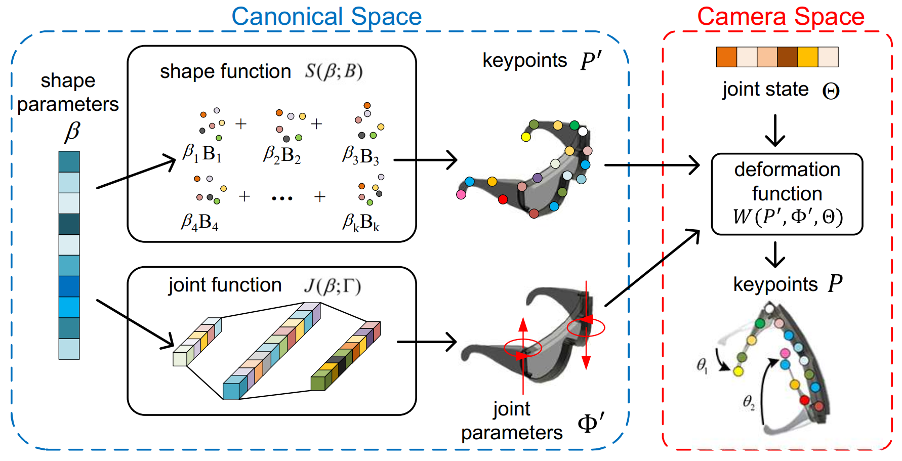

# OMAD: Object Model with Articulated Deformations

This repository is the official implementation of the paper
[OMAD: Object Model with Articulated Deformations for Pose Estimation and Retrieval](https://sites.google.com/view/omad-bmvc//). This paper has been accepted to BMVC 2021.




## Datasets
[ArtImage](https://drive.google.com/file/d/1Gp3muPrSY7BPrePhbO1M4U0DQVd_4OqV/view?usp=sharing) dataset contains the synthetic images generated from Unity along with the following annotations:

- RGB image
- depth map
- part mask
- part pose

This dataset also contains **URDF** articulated object models of five categories from PartNet-Mobility, 
which is re-annotated by us to align the rest state in the same category.

## Usage
### Installation

Environments:

- Python >= 3.7
- CUDA >= 10.0

```bash
git clone https://github.com/xiaoxiaoxh/OMAD.git
cd OMAD
```

Install the dependencies listed in ``requirements.txt``

```
pip install -r requirements.txt
```

Then, compile CUDA module - index_max:

```bash
cd models/index_max_ext
python setup.py install
```

Finally, download [ArtImage](https://drive.google.com/file/d/1Gp3muPrSY7BPrePhbO1M4U0DQVd_4OqV/view?usp=sharing) Dataset and put it in `OMAD/data` folder.

Now you are ready to go!

### Training of OMAD-PriorNet

```bash
python train_omad_priornet.py --num_kp  24  --work_dir  work_dir/omad_priornet_laptop  --category 1 --num_parts 2  --use_relative_coverage  --symtype shape
```

### Testing of OMAD-PriorNet

```bash
python test_omad_priornet.py --num_kp  24 --checkpoint  model_current_laptop.pth  --work_dir  work_dir/omad_priornet_laptop  --bs  16  --workers  0  --use_gpu  --symtype shape --out  --mode train

python test_omad_priornet.py --num_kp  24 --checkpoint  model_current_laptop.pth  --work_dir  work_dir/omad_priornet_laptop  --bs  16  --workers  0  --use_gpu  --symtype shape --out  --mode val
```

### Training of OMADNet

```bash
python  train_omad_net.py --num_kp 24  --work_dir  work_dir/omad-net_laptop  --params_dir  work_dir/omad_priornet_laptop  --num_basis  10  --symtype shape
```

### Testing of OMADNet

```bash
python test_omad_net.py  --num_kp 24 --checkpoint model_current_laptop.pth --work_dir work_dir/omad-net_laptop   --params_dir work_dir/omad_priornet_laptop  --category 1 --num_basis 10 --num_parts 2 --symtype shape --kp_thr 0.1 --reg_weight 0  --out raw_results.pkl --num_process 8 --use_gpu  --data_postfix final_test --shuffle
```
